# Arnab Gupta

**Senior Distributed Systems & Infrastructure Engineer** · Bengaluru, India

I build the systems that don't fall over at 3am — high-throughput messaging, caching, and cloud-native platforms that stay up under load.

[Portfolio](https://cvfy.dev/u/arnabgupta) · [LinkedIn](https://www.linkedin.com/in/arnab-gupta-304a17137/) · [X](https://x.com/A_GUPTA_) · [GitHub](https://github.com/A-G-U-P-T-A) · [Email](mailto:arnabgupta91996@gmail.com)

---

### About

Senior Software Engineer with **6+ years** designing and operating high-throughput distributed systems and cloud-native infrastructure. I work across **Java, Python, C, and Rust**, and spend most of my time on performance, reliability, and systems that have to scale.

### What I do

- Design and ship **rate limiting, prioritization, and traffic-shaping** systems for high-volume messaging platforms
- Build **distributed caches and Redis-backed libraries** that hold up under heavy concurrent load
- Run production services on **Kubernetes** — migrations, autoscaling, image/runtime optimization, CI/CD
- Improve **latency, throughput, and cost** through profiling, load testing, and careful concurrency design
- Modernize legacy services into **containerized, cloud-native** architectures
- Build **APIs, microservices, and data pipelines** (search, analytics, reconciliation, KYC-scale workloads)
- Experiment with **AI agent tooling** (MCP, LangGraph, LLM-assisted workflows)
- Configure and build **Slack bots** and workspace integrations

### Experience

| Role | Company | When |
| --- | --- | --- |
| Senior Software Engineer - 2 | [Gupshup](https://www.gupshup.io/) | Oct 2025 – Present |
| Senior Software Engineer - 1 | Gupshup | Nov 2023 – Sep 2025 |
| Senior Software Engineer | Airtel Africa Digital Labs | Jul 2022 – Oct 2023 |
| Software Engineer | Airtel Africa Digital Labs | Dec 2020 – Jun 2022 |
| Software Engineer | Tracxn Technologies | May 2020 – Oct 2020 |
| Associate Software Engineer | Quikr India | Jul 2019 – May 2020 |

### Stack

| | |
| --- | --- |
| **Languages** | Java, Python, C, Rust, SQL, Bash |
| **Frameworks & Backend** | Spring Boot, FastAPI, REST APIs, Microservices |
| **Distributed Systems & Infra** | Redis, RabbitMQ, Kubernetes, Docker, RocksDB, SeaweedFS |
| **Cloud & DevOps** | AWS, GitLab CI/CD, Jenkins, Linux |
| **Data** | MySQL, Google BigQuery, Elasticsearch, MongoDB |
| **AI & Developer Tooling** | LLM Agents, MCP, LangGraph, OpenRouter, Cursor |
| **Integrations** | Slack bots & workspace automation |
| **Performance** | JMeter, load testing, profiling, concurrency, throughput optimization |

### Selected projects

- **[Dola AI](https://dolaai.pro)** — Multi-agent Unreal Engine platform (Python, LangGraph, MCP, native UE plugin)
- **[Wireshark MCP](https://github.com/A-G-U-P-T-A/wireshark-mcp)** — Packet analysis for AI agents via TShark / Wireshark
- **[EmbeddedMQ](https://github.com/A-G-U-P-T-A/EmbeddedMQ)** — Embedded low-latency message queue · [docs](https://a-g-u-p-t-a.github.io/EmbeddedMQ/)
- **[qr-file-transfer](https://github.com/A-G-U-P-T-A/qr-file-transfer)** — Offline file transfer by flashing QR frames · [demo](https://a-g-u-p-t-a.github.io/qr-file-transfer/)
- **[Essentials C++](https://www.fab.com)** — Production Unreal Engine 5 plugin (Fab Marketplace)
- **[Draw Any](https://draw-any.up.railway.app)** — Natural language → structured flowcharts

### Education

B.Tech, Computer Science & Engineering — KIIT University, Bhubaneswar (2019)

---

### Activity

| Currently Working On - Last 28 days | wireshark-mcp Activity Trends |
| --- | --- |
| <a href="https://next.ossinsight.io/widgets/official/compose-currently-working-on?activity_type=all&user_id=21005910" target="_blank"><picture><source media="(prefers-color-scheme: dark)" srcset="https://next.ossinsight.io/widgets/official/compose-currently-working-on/thumbnail.png?activity_type=all&user_id=21005910&image_size=auto&color_scheme=dark"></picture></a> | <a href="https://next.ossinsight.io/widgets/official/compose-activity-trends?repo_id=958029965" target="_blank"><picture><source media="(prefers-color-scheme: dark)" srcset="https://next.ossinsight.io/widgets/official/compose-activity-trends/thumbnail.png?repo_id=958029965&image_size=auto&color_scheme=dark"></picture></a> |

| wireshark-mcp Star History | qr-file-transfer Activity Trends |
| --- | --- |
| <a href="https://next.ossinsight.io/widgets/official/analyze-repo-stars-history?repo_id=958029965" target="_blank"><picture><source media="(prefers-color-scheme: dark)" srcset="https://next.ossinsight.io/widgets/official/analyze-repo-stars-history/thumbnail.png?repo_id=958029965&image_size=auto&color_scheme=dark"></picture></a> | <a href="https://next.ossinsight.io/widgets/official/compose-activity-trends?repo_id=1327647895" target="_blank"><picture><source media="(prefers-color-scheme: dark)" srcset="https://next.ossinsight.io/widgets/official/compose-activity-trends/thumbnail.png?repo_id=1327647895&image_size=auto&color_scheme=dark"></picture></a> |

<!-- Made with [OSS Insight](https://ossinsight.io/) -->
